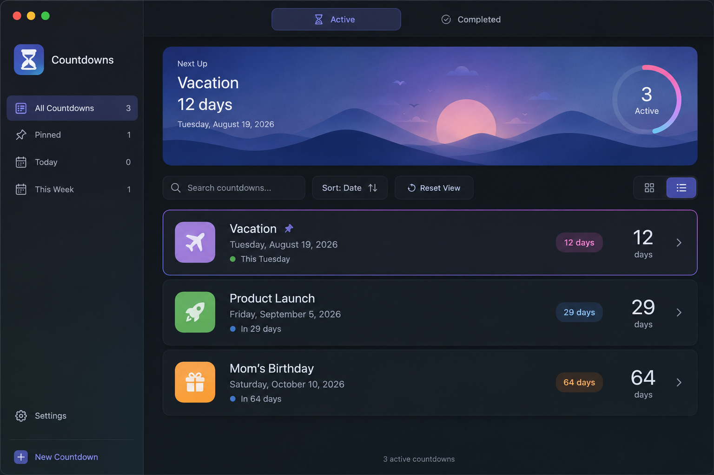

<a id="top"></a>

# Countpane

**Keep the dates that matter visible, without filling your calendar.**

Countpane is a private, native Mac app for deadlines, anniversaries, trips, launches, and every other date you do not want to lose track of. It lives in the macOS menu bar, where its calendar icon opens the management window; create a countdown once, then keep it on your desktop as a small, always-visible widget while you work.

<a id="table-of-contents"></a>

## Table of contents

- [Install with Homebrew](#install-with-homebrew)
- [Why Countpane](#why-countpane)
- [What you can do](#what-you-can-do)
- [Get started](#get-started)
- [Privacy and backups](#privacy-and-backups)
- [Updates](#updates)
- [Build from source](#build-from-source)
- [Releases and quality](#releases-and-quality)
- [Security and license](#security-and-license)

## ⚡ Install with Homebrew

Install Countpane with:

```bash
brew tap sashplatonov/apps
brew install --cask countpane
```

Or install the fully qualified cask in one line:

```bash
brew install --cask sashplatonov/apps/countpane
```

Then open **Countpane** from Applications. Countpane stays in the menu bar instead of the Dock; click its calendar icon whenever you want to reopen the management window. To update later:

```bash
brew update
brew upgrade --cask countpane
```

[↑ Back to top](#top)



## ✨ Why Countpane

Calendars are excellent for appointments. Countpane is for the dates you want to keep in view between appointments: a visa deadline, a birthday, a move, a product launch, or a long-awaited trip.

- Keep upcoming dates visible in independent, rounded desktop widgets.
- See the remaining time in plain language, from days to years and months.
- Work privately: no account, cloud sync, analytics, or server is required.
- Focus on what is next with search, pinning, sorting, and a dedicated **Next Up** view.

[↑ Back to top](#top)

## 🧩 What you can do

- Create active and completed countdowns with notes, symbols, and individual themes.
- Choose compact Rows or a responsive Card Grid for the main dashboard.
- Show or hide a floating widget for each active countdown.
- Set urgency stages so approaching dates are easy to spot.
- Pin important items, shift dates quickly, mark items complete, restore them, or undo the last change.
- Start Countpane at login and show widgets without opening the main window.
- Use light, dark, or adaptive application themes.
- Export a backup before moving to another Mac, then import it when needed.

[↑ Back to top](#top)

## 🚀 Get started

1. Click the Countpane calendar icon in the menu bar and choose **Show Main Window**.
2. Select **Add Countdown**.
3. Give it a title and target date; add a note, symbol, or colour if helpful.
4. Enable its desktop widget to keep the countdown visible above other windows.
5. In Settings, adjust urgency stages, appearance, Launch at Login, and automatic update checks.
6. Use **Export** in Settings before changing Macs or making a major edit to your list.

[↑ Back to top](#top)

## 🔒 Privacy and backups

Your countdowns stay on your Mac at:

```text
~/Library/Application Support/Countpane/countpane.sqlite3
```

Countpane has no account or analytics service. Automatic update checks are optional; they query the public GitHub Releases API and send only the product version. Titles, dates, notes, and backup files are never transmitted.

Runtime state is stored in a local SQLite database. Backups use Countpane's current versioned JSON interchange format. Import checks the format, duplicate identifiers, required titles, and urgency settings before replacing the local list. Unsupported backup formats are rejected rather than changed silently.

📝 Keep exported backups somewhere you control, such as an encrypted drive or your own private cloud folder.

[↑ Back to top](#top)

## 🔄 Updates

Countpane can check for a new version automatically or when you ask it to. For a Homebrew installation, **Install Update** runs a bounded Homebrew update outside the app's interface. For a DMG installation, Countpane opens the newest release page.

If Homebrew is unavailable, the tap has not propagated yet, the network is offline, or GitHub rate-limits a request, Countpane explains the problem without exposing your data.

[↑ Back to top](#top)

## 🛠️ Build from source

Requirements: macOS 15+ and Xcode 16+.

```bash
git clone https://github.com/sashplatonov/countpane.git
cd countpane
swift test
./Scripts/build-app.sh 1.0.0
open dist/Countpane.app
```

Build a local DMG:

```bash
./Scripts/build-dmg.sh 1.0.0
```

Build a native local DMG when testing a specific Mac architecture:

```bash
./Scripts/build-dmg.sh 1.0.0 arm64
./Scripts/build-dmg.sh 1.0.0 x86_64
```

[↑ Back to top](#top)

## ✅ Releases and quality

GitHub Actions keeps normal feedback fast with one native Apple Silicon test
lane and a Universal app/cask validation lane. A semantic tag such as
`v1.0.0` runs the full native arm64 and x86_64 test matrix, builds signed
native DMGs and checksums, publishes both to a GitHub Release, and generates an
architecture-aware Homebrew cask. The Universal CI build is compile and
packaging compatibility coverage; native Intel runtime proof belongs to the
release workflow.

```bash
git tag v1.0.0
git push origin v1.0.0
```

To create and push the next release tag interactively, from a clean checkout
run:

```bash
./Scripts/create-and-push-tag.sh
```

The script prints the current reachable tag, asks for a new `vMAJOR.MINOR.PATCH`
tag, checks local and remote duplicates, creates an annotated tag, and pushes it
to `origin`. Use `./Scripts/create-and-push-tag.sh --dry-run` to validate the
input without creating or pushing a tag.

Packaging uses Hardened Runtime and ad-hoc signing. A Developer ID certificate and Apple notarization are still required for distribution without Gatekeeper prompts; until they are configured, DMG and Homebrew distribution are experimental.

For release maintainers, see the [release checklist](docs/RELEASE_CHECKLIST.md).

[↑ Back to top](#top)

## 🛡️ Security and license

Report vulnerabilities privately according to [SECURITY.md](SECURITY.md). Never attach unredacted backups to a public issue.

Countpane is available under the [MIT License](LICENSE).

[↑ Back to top](#top)
