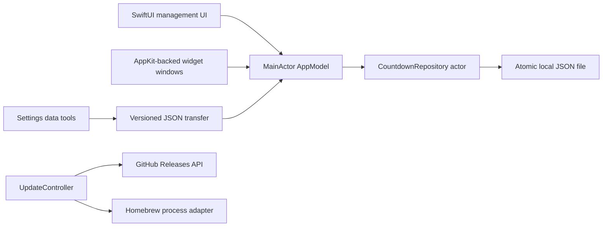

# Countpane

**Desktop Countdown Widgets for Mac**

Countpane is a native, local-first macOS application by [Sash Platonov](https://github.com/sashplatonov). It provides one focused dashboard for important dates and independent rounded countdown windows that remain visible above ordinary application windows.


## Highlights

- Multiple active and completed countdowns
- Human-readable durations such as `2 years 3 months 4 days`
- Configurable urgency stages
- Compact Row and responsive Card Grid layouts
- Independent rounded always-on-top desktop widgets
- Light and dark application themes plus per-countdown themes
- Search, sorting, pinning, quick date shifts, completion, restore, and one-level undo
- Launch at Login with background widget startup
- Local-only storage with atomic JSON writes
- Versioned JSON import and export for backups and moving data between Macs
- Semantic product versions, automatic build timestamps, and an in-app update center

## Why This Project

I am primarily a Senior Java Backend Engineer. Countpane is intentionally local-first and backend-free: a server, account system, database, or network API would not improve its core use case.

I built it to demonstrate end-to-end product ownership outside my main stack: learning platform-specific APIs, designing deterministic state transitions, using concurrency-safe persistence, integrating SwiftUI with AppKit window behavior, writing tests, and automating packaging and releases.

## Tech Stack

- macOS 15+ on Apple Silicon or Intel
- Swift 6
- SwiftUI and AppKit
- Observation with `@Observable`
- Actor-isolated atomic JSON persistence
- Swift Testing
- ServiceManagement for Launch at Login
- GitHub Actions
- Universal Binary DMG and Homebrew Cask packaging

## Architecture



The application separates management UI, desktop-widget windows, application state, and persistence. SwiftUI handles the product interface, while AppKit integration controls activation, keyboard focus, window levels, and independent floating windows.

The project uses Swift Package Manager as the source and test build system. Packaging scripts assemble the standard macOS application bundle (`Contents/Info.plist`, `Contents/MacOS`, and `Contents/Resources`). This keeps the repository lightweight and makes the build steps explicit, at the cost of managing signing and packaging outside an Xcode application target.

## Project Structure

```text
.
├── Package.swift
├── Sources/Countpane/
│   ├── App/
│   ├── Models/
│   ├── Services/
│   ├── UI/
│   ├── Views/
│   └── Resources/
├── Tests/CountpaneTests/
├── Packaging/
├── Scripts/
├── .github/workflows/
└── docs/
```

**Repository:** [github.com/sashplatonov/countpane](https://github.com/sashplatonov/countpane)

## Build from Source

Requirements:

- macOS 15 or newer
- Xcode 16 or newer

```bash
git clone https://github.com/sashplatonov/countpane.git
cd countpane
swift test
./Scripts/build-app.sh 1.0.0
open dist/Countpane.app
```

Build a DMG locally:

```bash
./Scripts/build-dmg.sh 1.0.0
```

## Releases

CI runs the test suite natively on both Apple Silicon (`macos-15`) and Intel (`macos-15-intel`). Tagged releases are built by `.github/workflows/release.yml`:

```bash
git tag v1.0.0
git push origin v1.0.0
```

The release workflow runs the tagged source natively on both Apple Silicon and Intel, builds the Universal app, creates a versioned DMG and checksum, publishes a GitHub Release, and generates a Homebrew Cask. Release tags must use semantic versions such as `v1.2.0`.

The build produces one Universal Binary containing `arm64` and `x86_64`. Packaging includes an explicit entitlements file and Hardened Runtime. The current public workflow still uses ad-hoc signing unless a Developer ID certificate is provided. Public distribution without Gatekeeper friction requires a Developer ID Application certificate and Apple notarization. Until signing and notarization are configured and verified, DMG and Homebrew installation should be treated as **experimental**.

## Homebrew

After a verified release and a configured `sashplatonov/homebrew-countpane` repository:

```bash
brew tap sashplatonov/tap
brew install --cask countpane
```

The `HOMEBREW_TAP_TOKEN` repository secret updates the Cask in `sashplatonov/homebrew-countpane` whenever a tagged release is published. Without it, the release still contains a generated `countpane.rb` asset for manual publication.

Update Countpane manually:

```bash
brew update
brew upgrade --cask countpane
```

Homebrew updates its package metadata automatically before many commands, but it does not silently upgrade Countpane in the background. To enable periodic background upgrades only for Countpane, install the maintained `brew autoupdate` external command and create a launch agent:

```bash
brew tap domt4/autoupdate
brew trust --command domt4/autoupdate/autoupdate
brew autoupdate start 1d --upgrade --cleanup --immediate --only=sashplatonov/tap/countpane
```

Check or disable it with:

```bash
brew autoupdate status
brew autoupdate delete
```

This updater is optional and maintained outside the Countpane repository.

## Testing

```bash
swift test
```

Tests are grouped by responsibility and cover duration formatting, urgency, persistence, JSON transfer validation, filtering and sorting, undo, Next Up selection, widget presentation, themes, startup behavior, semantic release comparison, update states, Homebrew failures, and process timeouts.

## Data and Privacy

Countpane requires no account or analytics service. Countdown data remains local at:

```text
~/Library/Application Support/Countpane/countpane.json
```

Writes use an actor-isolated repository and atomic file replacement. Pending changes are flushed when the application terminates.

Settings includes versioned JSON export and import. Import validates the current schema, duplicate identifiers, required titles, and urgency thresholds before asking the user to replace the existing local collection. Countpane does not silently migrate unsupported backup formats.

Automatic update checks are optional and enabled by default. They make a read-only request to the public GitHub Releases API and send only the Countpane product version in the User-Agent. Countdown titles, dates, notes, JSON backups, and other personal data are never transmitted. Homebrew is invoked only after the user explicitly chooses **Install Update**.

## Product and Build Versions

GitHub tags and `CFBundleShortVersionString` use semantic product versions such as `1.2.0`. The updater compares these values numerically.

Each `.app` build also receives an automatic timestamp in `yyyyMMdd-HHmm` format. `Scripts/build-app.sh` stores it as build metadata and About displays both values. Set `BUILD_TIMESTAMP` only for a reproducible CI identifier.

## Portfolio Positioning

Countpane demonstrates engineering breadth and complete product delivery rather than Java backend architecture. The strongest signals are:

- native macOS window architecture beyond one SwiftUI scene;
- deterministic domain logic and concurrency-safe persistence;
- platform integration and troubleshooting;
- automated tests, packaging, GitHub Releases, and Homebrew generation;
- explicit local-first product and privacy decisions.

Suggested repository description:

> Native macOS countdown widgets built with SwiftUI and AppKit, featuring local persistence, floating desktop windows, tests, CI/CD, DMG packaging, and Homebrew automation.

Suggested topics:

`macos` `swift` `swiftui` `appkit` `countdown` `desktop-widget` `macos15` `observation` `swift-testing` `homebrew-cask`

## Release Verification

Before promoting a release, complete [the release checklist](docs/RELEASE_CHECKLIST.md).

## License

MIT


## Software Updates

Countpane can check the public GitHub Releases API manually or automatically. Automatic checks can be disabled in Settings. The app compares semantic product versions, not build dates.

For Homebrew installations, **Install Update** runs a bounded, non-interactive Homebrew update outside the UI thread. For DMG installations, Countpane opens the latest release page. The updater reports unavailable Homebrew, timeouts, tap propagation delays, GitHub rate limits, and offline failures without exposing private countdown data.

## Security

See [SECURITY.md](SECURITY.md) for private vulnerability reporting. Do not attach unredacted JSON backups to public issues.
